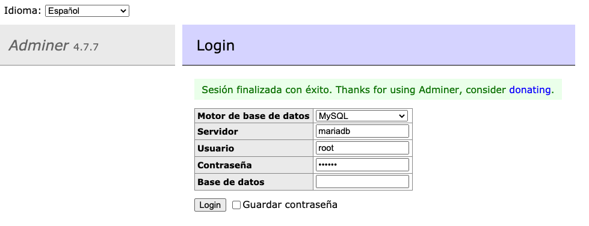

# Express/Node Service with Typescript and MariaDB

### Installs

With `package.json` and dependencies
```shell
docker-compose run app yarn
```

Without dependencies
```shell
docker-compose run app yarn express
docker-compose run app yarn add nodemon typescript @types/express copyfiles --dev
```

> run `npm install -g typescript`

> run `tsc -v`

> run `tsc --init` output `tsconfig.json`

```json
// tsconfig.json
...
// "outFile": "./",                       /* Concatenate and emit output to single file. */
"outDir": "./dist",                       /* Redirect output structure to the directory. */
// "rootDir": "./",                       /* Specify the root directory of input files. Use to control the output directory structure with --outDir. */
...
```
> run `tsc` output `./dist/index.js`

### Start Project

> run `docker-compose up`

### Project Structure

> run `tree -I "node_modules|data|screenshots"`
```shell
.
├── Dockerfile
├── README.md
├── dist
│   ├── index.js
│   └── server
│       └── server.js
├── docker-compose.yml
├── package.json
├── src
│   ├── index.ts
│   ├── mysql
│   ├── public
│   ├── router
│   └── server
│       └── server.ts
├── tsconfig.json
├── yarn-error.log
└── yarn.lock

7 directories, 11 files
```

### App service

> `localhost:8080` you can change the port in `docker-compose.yml` file `<host-port>:3000`

### Adminer sevice

> `localhost:8081` you can change the port in `docker-compose.yml` file `<host-port>:8080`

<p align="center">
  <kbd>
    
  </kbd>
</p>

